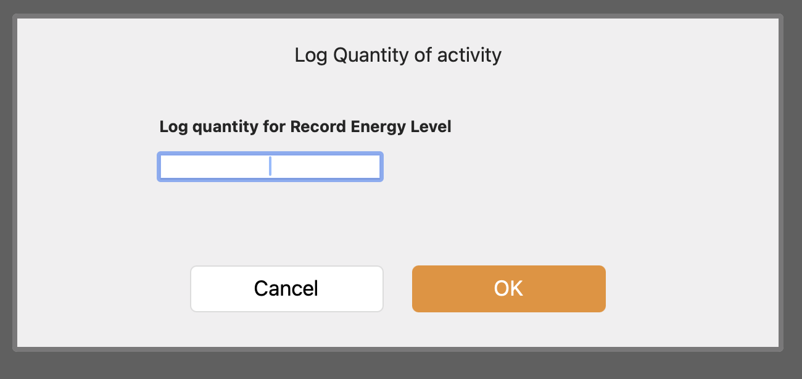
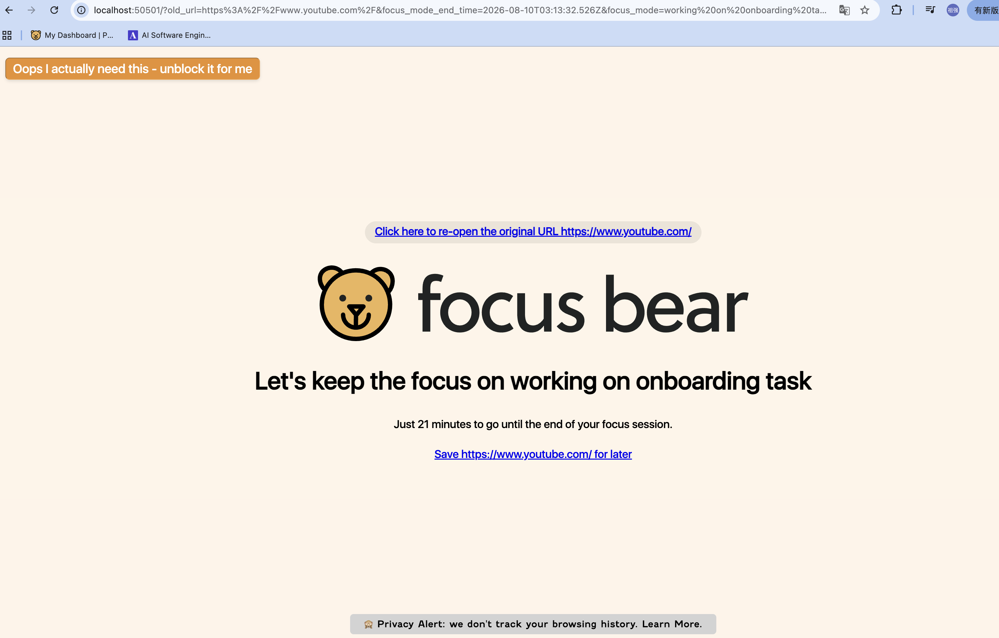
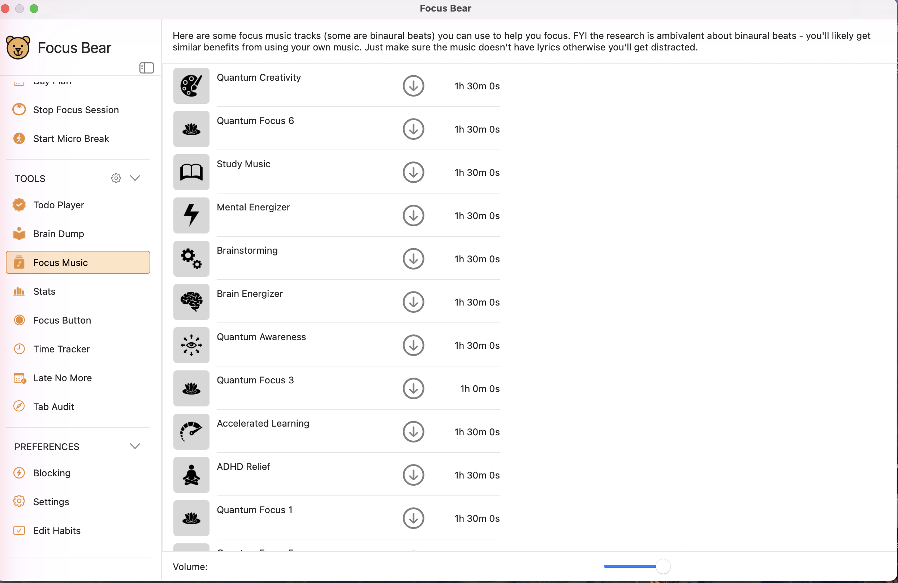
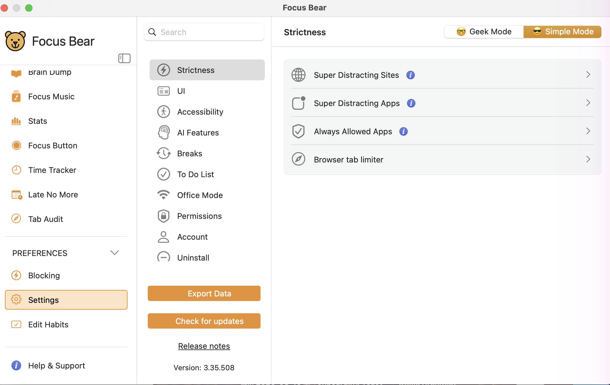

# Focus Bear App – UX Confusion Points

## 1. No obvious way to open the main dashboard

When I clicked the Focus Bear icon in the menu bar, I was only presented with a compact dropdown panel.
As a new user, I had no idea how to open the full dashboard. There is no clearly visible entry point in the dropdown — I eventually found it through the settings icon, but this was far from intuitive. For first-time users or those unfamiliar with this type of app, it's very easy to miss. I would suggest adding a clearly labeled "Open Dashboard" or "Open Main Window" button in the dropdown to make it more discoverable.

## 2. The purpose of the pin button is unclear

There is a pin button in the menu bar dropdown.
When clicked, the panel stays on top of all other windows. I assumed it might be useful for keeping an eye on focus time or quickly accessing features,

but it only works in windowed mode - when switching to a full-screen app, the panel disappears entirely. 
This made me unsure about the intended use case for this feature. A short tooltip or description next to the pin button would go a long way in helping users understand when and why they should use it.

## 3. Missing units and input range guidance

When logging sleep duration in the Day Plan, no unit is shown — I had to guess it was in hours.
Similarly, when logging Energy Level and Mood, there is no indication of the expected range (e.g. out of 5, 10, or 100),

as shown in the screenshot above. For users logging these for the first time, this ambiguity makes it unclear what a valid or meaningful input looks like. Adding a unit label (e.g. "hrs") next to the sleep input, and a range hint (e.g. "1–10") below the Energy and Mood fields, would make the experience much clearer.

## 4. AI-powered blocking does not seem context-aware

When starting a focus session, I noticed a "AI powered blocking (recommended)" option under Blocking Style.

I expected it to intelligently allow or block websites based on the task I was working on — for example, if my goal was to learn about Focus Bear's playlist and watch related videos, I assumed it would allow access to relevant video content while blocking unrelated distractions.

However, it still blocked the content I needed for my task. This made me question what the AI-powered blocking actually does differently from the standard blocking option, and whether it takes the session goal into account at all.
A short explanation of how the AI determines what to block — either as a tooltip on the ⓘ icon or in an onboarding note — would help users set realistic expectations and use this feature more effectively.

## 5. No visible option to add custom music in Focus Music

The description at the top of the Focus Music page mentions that users can add their own music files. However, there is no visible button or clear entry point to do so — I could not find an "Add" or "Import" option anywhere on the page.

I also looked through the Settings page but found no option related to adding custom music either.
For a feature that is explicitly mentioned in the UI, the lack of a visible way to access it is confusing and may lead users to think the feature is broken or unavailable. Adding a clearly labeled "Add Music" or "Import" button directly on the Focus Music page would make this much more intuitive.
