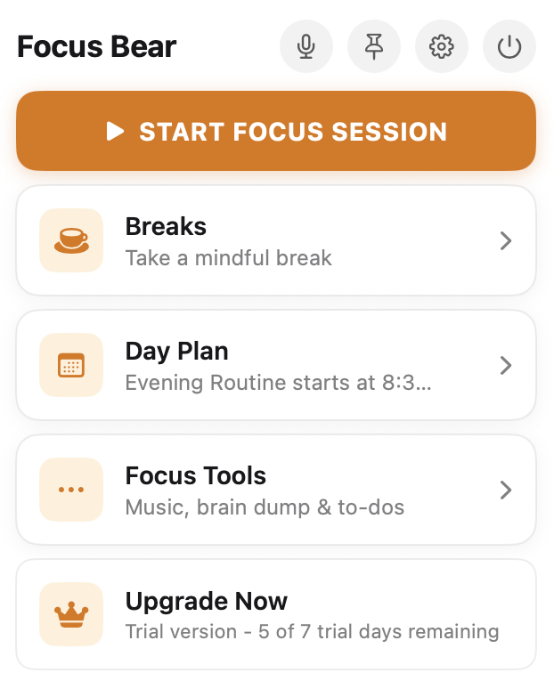
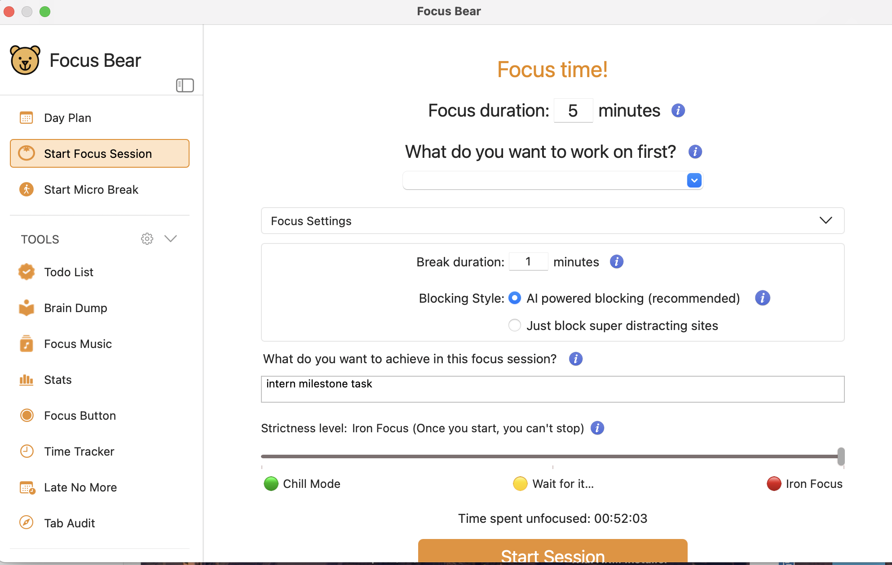
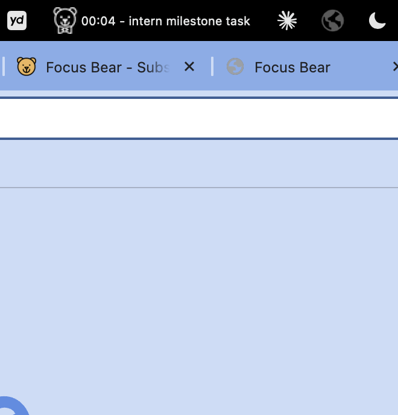
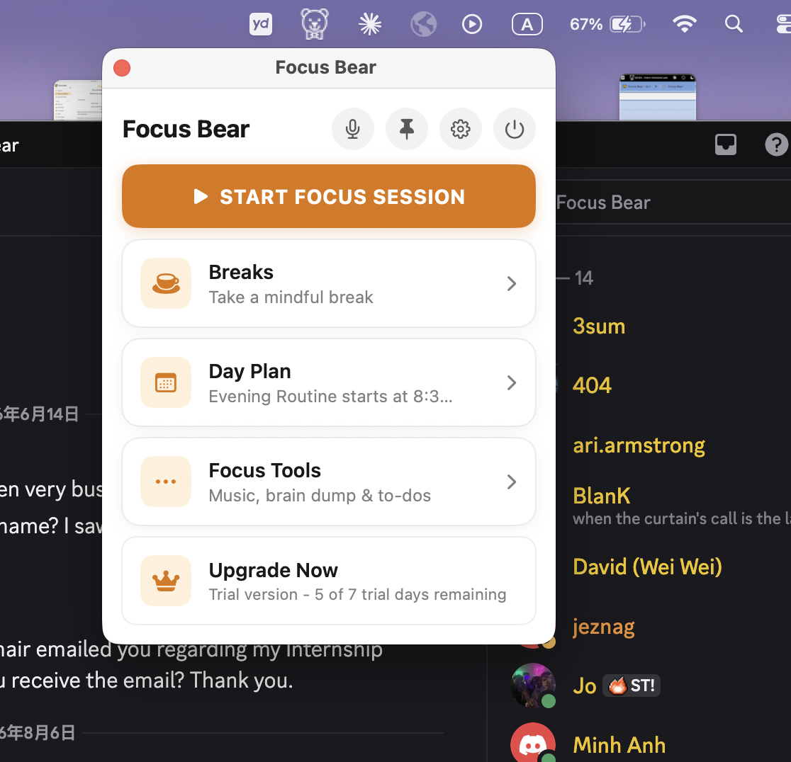
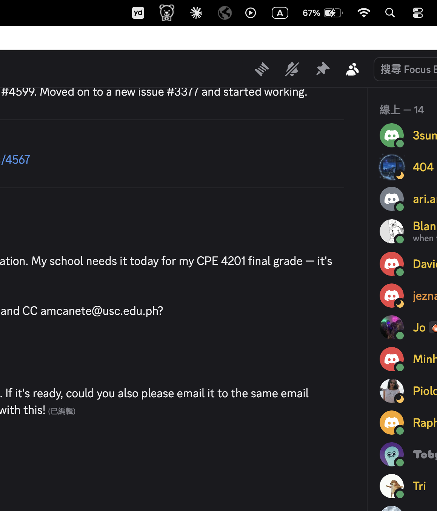

# Focus Bear App – UX Confusion Points

## 1. No obvious way to open the main dashboard

When I clicked the Focus Bear icon in the menu bar, I was only presented with a compact dropdown panel. 
As a new user, I had no idea how to open the full dashboard. There is no clearly visible entry point in the dropdown — I eventually found it through the settings icon, but this was far from intuitive. For first-time users or those unfamiliar with this type of app, it's very easy to miss. I would suggest adding a clearly labeled "Open Dashboard" or "Open Main Window" button in the dropdown to make it more discoverable.

## 2. The purpose of the pin button is unclear

There is a pin button in the menu bar dropdown. 
When clicked, the panel stays on top of all other windows. I assumed it might be useful for keeping an eye on focus time or quickly accessing features, 

but it only works in windowed mode - when switching to a full-screen app, the panel disappears entirely.  
This made me unsure about the intended use case for this feature. A short tooltip or description next to the pin button would go a long way in helping users understand when and why they should use it.